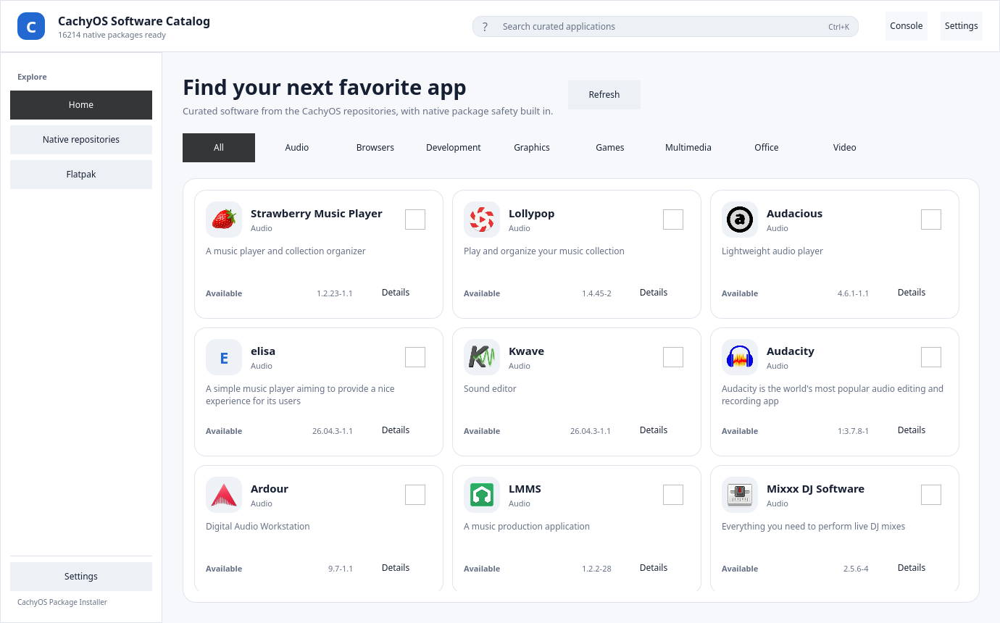
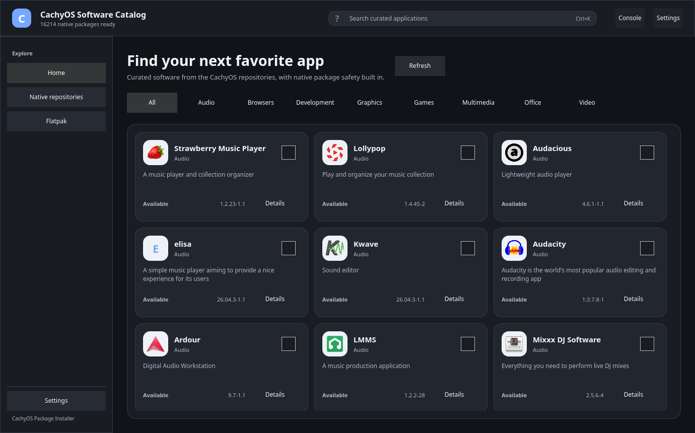
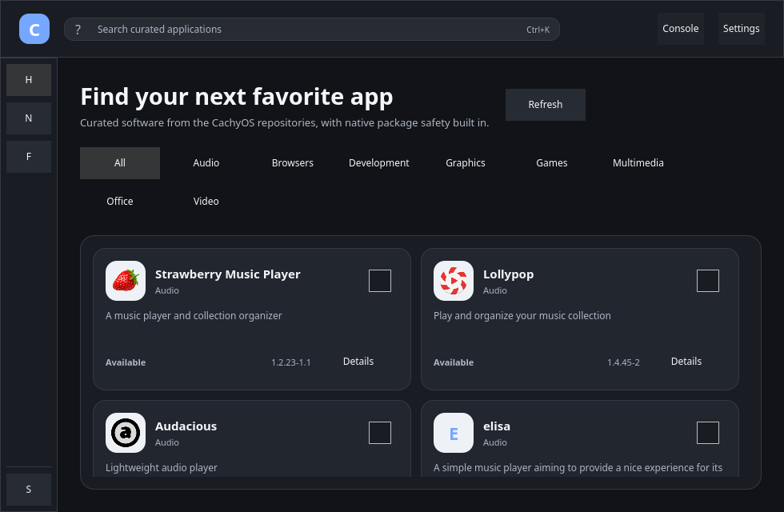

# CachyOS Package Installer - Redesigned

A modern Qt 6 desktop software catalog for CachyOS. The application preserves
the reference package-management model while providing a responsive Fluent
2-inspired interface for curated applications, native repositories, and
Flatpak software.

## Overview

The catalog provides:

- Curated application categories backed by the CachyOS package list
- Native pacman repository browsing, search, filtering, details, and status
- Flatpak application and runtime discovery with system/user scopes
- AppStream names, descriptions, icons, screenshots, and homepage metadata
- Dependency, conflict, target, and size previews before native changes
- Install, remove, selected upgrade, full upgrade, orphan cleanup, and batch actions
- Flatpak install, remove, selected/full updates, unused-runtime cleanup, remotes, and Flatpakref support
- Streaming console output, interactive input, cancellation, settings, themes, logging, and translations

Architecture and safety decisions are documented in `DESIGN.md`. Development
rules are documented in `AGENTS.md`.

## Build & Run

```sh
cmake -S . -B build -G Ninja -DCMAKE_BUILD_TYPE=RelWithDebInfo
cmake --build build --parallel
./build/cachyos-catalog
```

To install into a prefix:

```sh
cmake -S . -B build -G Ninja \
  -DCMAKE_BUILD_TYPE=RelWithDebInfo \
  -DCMAKE_INSTALL_PREFIX=/usr
cmake --build build --parallel
sudo cmake --install build
```

### Dependencies

- Qt 6.5 or newer: Core, Gui, Qml, Quick, QuickControls2, Network, Test, LinguistTools
- CMake 3.22 or newer and Ninja or another supported generator
- `libalpm` 13 or newer
- AppStream 1.0 or newer
- `pacman`, `pacman-conf`, `pkexec`, and Polkit for native system operations
- Flatpak for Flatpak discovery and operations

Flatpak is optional for native repository use. The application reports missing
runtime tools without silently changing system configuration.

## Security Model

The application deliberately keeps metadata and mutation paths separate:

- libalpm is used for read-only metadata, installed-state detection, upgrade detection, and transaction previews.
- Preview transactions use `DB_ONLY`, dependency/explicit-target flags, and `NO_LOCK`; they are always released without commit.
- Real native mutations run through `pkexec pacman` after confirmation and an immediate pacman-lock check.
- Flatpak mutations use argv-safe `QProcess` calls with the selected system/user scope.
- Package names, remote names, URLs, and paths are never interpolated into shell commands.
- The GUI refuses root execution, enforces a single instance, and checks the configured pacman database before loading.
- Verification uses read-only database/Flatpak queries and fake process/argv tests. It does not install, remove, upgrade, or modify remotes on the host.

## Tests

```sh
ctest --test-dir build --output-on-failure
```

The test suite covers curated and nested catalogue parsing, model filtering
and selection, libalpm enumeration and non-mutating previews, Flatpak parsing
and read-only integration, argv construction, failed process startup,
cancellation, and QML linting.

For an offline UI smoke run:

```sh
QT_QPA_PLATFORM=offscreen \
CACHYOS_CATALOG_OFFLINE=1 \
./build/cachyos-catalog
```

## Screenshots

Discover - curated applications:



Dark theme and HiDPI:



Compact responsive layout:



## License

GPL-2.0-or-later. See `LICENSE`.

## Fork Lineage

The reference behavior is based on
[CachyOS/packageinstaller](https://github.com/CachyOS/packageinstaller).
The reference repository is treated as read-only during development.
