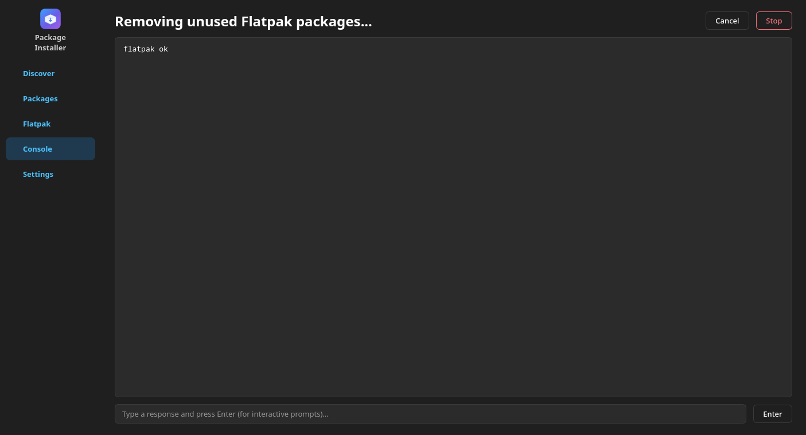
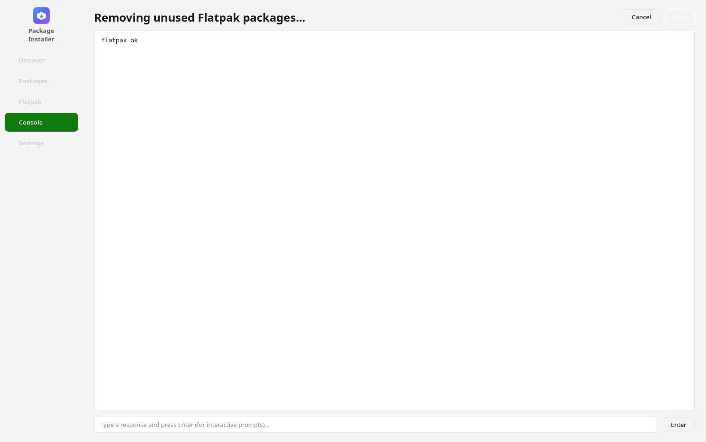
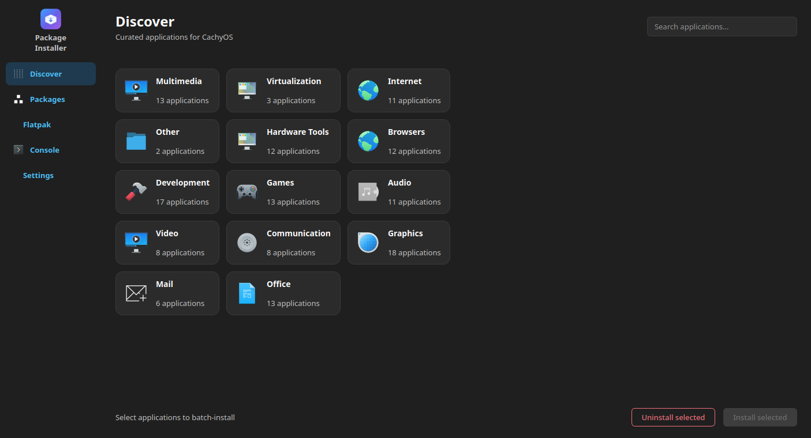

# CachyOS Package Installer — Redesigned (benchmark build)

A modern, fast, polished Qt desktop software catalog that preserves the
complete functionality and fundamental architecture of the original
CachyOS Package Installer.

> **Benchmark provenance**: this repository is a from-scratch redesign produced
> as an autonomous engineering benchmark. It was written **by the model
> DeepSeek V4 Flash (0731)** from a **single one-shot prompt** — the whole
> project (architecture, implementation, tests, debugging and this
> documentation) was completed autonomously without iterative prompting.
>
> - Model: **DeepSeek V4 Flash (0731)**
> - Prompt style: **one-shot** (single prompt, fully autonomous execution)
> - Tokens spent: **552447**
> - Cost: **$0.35**
>
> The reference implementation (`CachyOS/packageinstaller`) was used strictly
> as the authoritative spec; it was never modified.

## Overview

Fluent 2-inspired UI with a left navigation rail and five pages:
**Discover** (curated applications with AppStream artwork and screenshots),
**Packages** (full repository browser), **Flatpak**, **Console** and
**Settings** (System/Light/Dark themes, persisted).

The package-management engine mirrors the reference semantics exactly:
libalpm-based transaction previews and conflict detection
(`DB_ONLY | ALL_DEPS | ALL_EXPLICIT | NO_LOCK`, never committed), all real
operations through `pkexec pacman` / `flatpak` (socat PTY wrappers), the
same startup guards (single instance, valid DBs, root refusal, pacman lock)
and the same Flatpak scope/remote/filter model.

Architecture and decisions are documented in `DESIGN.md`; agent guidance in
`AGENTS.md`.

## Build & run

```sh
cmake -S . -B build -G Ninja -DCMAKE_BUILD_TYPE=Release
cmake --build build
./build/cachyos-pi
```

Dependencies: Qt 6 (Widgets, Network, Concurrent, LinguistTools), libalpm
(>= 13), libappstream, polkit + pkexec, flatpak, socat, pacman.

## Tests

```sh
./tests/run_tests.sh build/cachyos-pi
```

Runs the scripted end-to-end suite (install/uninstall/upgrade/orphans,
Flatpak flows, transaction previews, conflict detection, failure paths,
themes, single-instance guard) against fake `pkexec/pacman/flatpak/socat`
fixtures — nothing touches the host system.

## Screenshots

Main window — dark theme:



Full-size window:



Running on a real desktop session (dark system theme):



## License

GPL-2.0-or-later (see `LICENSE`), matching the original project.

## Fork lineage

Forked from [CachyOS/packageinstaller](https://github.com/CachyOS/packageinstaller).
This branch carries the redesigned implementation as a full rewrite on top of
the original history.
